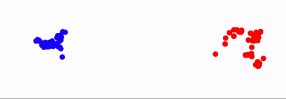

# BayesAlpha

Bayesian models for alpha.

## Models

There are currently two models:

- the **returns model**, which ingests a returns-stream. It computes (among
  other things) a forwards-looking gains parameter (which is basically a
  Sharpe ratio). Of interest is `P(gains > 0)`; that is, the probability that
  the algorithm will make money. Originally authored by Adrian Seyboldt.

- the **author model**, which ingests the in-sample Sharpe ratios of user-run
  backtests. It computes (among other things) average Sharpe delivered at a
  population-, author- and algorithm-level. Originally authored by George Ho.

## Installation and Usage

To install:

```bash
git clone git@github.com:quantopian/bayesalpha.git
cd bayesalpha
pip install -e .
```

To use (this snippet should demonstrate 95% of all use cases):

```python
import bayesalpha as ba

# Fit returns model
trace = ba.fit_returns_population(data, ...)
trace = ba.fit_returns_single(data, ...)

# Fit author model
trace = ba.fit_authors(data, ...)

# Save to netcdf file
trace.save('foo.nc')
del trace

# Load from netcdf file
trace = ba.load('foo.nc')
```
